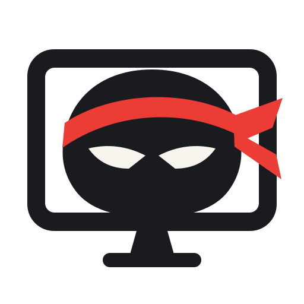

# Ninja Desk



Ninja Desk lets one owner view and control a signed-in PC from another PC or a browser. The Windows app can host and control another PC at the same time. An x86_64 Linux build targets X11 desktops, including Intel Macs running Linux. This repository contains the Tauri/Rust host, desktop controller, static browser companion, installers, documentation, and [agent context](./for-ai/README.md).

The browser page is public. The desktop stream and commands require either the random password generated by the host or a temporary access link created in the host app. Transport uses VDO.Ninja-compatible WebRTC via the pinned Ninja SDK, without RustDesk code or its server protocol. [DESIGN.md](./DESIGN.md) describes the security boundary and current qualification limits.

## Use

1. Download the `ninja-desk-windows-installer` artifact from the latest successful [Windows installer workflow](https://github.com/GeorgeFejer91/ninja-desk/actions/workflows/windows-installer.yml) and run the NSIS setup on Windows 10/11. The installer is unsigned, so Windows may show a publisher warning. For x86_64 Linux, use the `.deb` or `.AppImage` artifact from the [Linux installer workflow](https://github.com/GeorgeFejer91/ninja-desk/actions/workflows/linux-installer.yml). The Linux host targets X11; Wayland control is not supported.
2. Launch **Ninja Desk** while signed in. Save its generated 64-character password in a password manager. On Linux, click **Open browser host** and keep that local browser window open. For lower screen latency, click **Share primary display (fast)** in the host before connecting and choose the entire primary display in the browser prompt. This sends the browser's display track directly through WebRTC and requests up to 720p/60 fps; if unavailable, the app uses its automatic capture path. For a metered or slow connection, turn on **Low data mode** in the host before or during a session. It requests a 350 kbps video limit; fast capture requests at most 960×540 at 10 fps, while automatic capture sends changed frames at up to 10 fps and checks an idle screen every 500 ms. The installed app retains input, authorization, and clipboard authority.
3. On another installed Windows app, enter the host's access code under **Control remote desktop** and click **Connect**. While connected, the host owner clicks **Remember connected PC**. The controller saves a separate Windows-protected credential. It can then use **Reconnect** in **Saved computers**, rename the entry, or forget it. A controller can save up to 64 hosts; each host remembers one controller. **Revoke trusted PC** on the host ends its trusted route. The normal host access code still works after trust revocation; **Replace password** invalidates it too. On Linux, **Control another PC** opens the [browser companion](https://georgefejer91.github.io/ninja-desk/). For temporary browser access, create an access link on the host and open that URL; it lasts up to 24 hours during that app instance. Keep the host, its browser window if applicable, and the PC awake.
4. Press **Alt+F** while Ninja Desk has focus to enter or leave fullscreen. The connected Windows viewer uses OS fullscreen; its controls stay completely hidden, including at the screen edges and on Escape. **Alt+Tab** keeps normal Windows app switching and leaves the viewer fullscreen. **Alt+N** cycles the host's monitors without leaving fullscreen, wrapping to the first after the last. In windowed mode, **Next monitor** does the same; **Display** offers fit, original size, zoom, and reset, and **Clipboard** transfers text. Monitor switching requires a host and controller with version 0.1.7 or later. It switches fast capture back to automatic capture, opens a fresh screen stream, and pauses mouse input until that stream displays a frame. Browser fullscreen retains its platform exit shortcuts. Mouse and Touch modes retain click, drag, scroll, pinch, and pan. **Revoke link** invalidates a temporary link and its session. In **Settings**, **Stop remote access** revokes every session and **Replace password** clears trusted access and restarts the host.

One controller can connect at a time. Creating another link invalidates the old one. A link stops working when it expires, is revoked, or the host app closes or restarts. Anyone holding the URL can control the PC while it is valid, so share it only through a private channel. The companion removes the access fragment from the address bar after opening it. On Windows, closing the main window leaves Ninja Desk running in the tray; **Quit Ninja Desk** in the tray stops it. The optional **Start with Windows** toggle starts it hidden after sign-in. The connection uses VDO.Ninja signaling; WebRTC may select a direct peer route or a TURN relay. The viewer labels the selected route when browser stats expose it. This is not a service-free LAN mode. Browser clipboard permissions may require a user action, especially on phones.

## Build

On Windows, install Node.js 24, Rust stable with the Windows MSVC toolchain, and the Tauri v2 [Windows prerequisites](https://v2.tauri.app/start/prerequisites/#windows). On Linux, use the [Tauri Linux prerequisites](https://v2.tauri.app/start/prerequisites/#linux) and build on Ubuntu 22.04 or a similarly old supported base for broader AppImage compatibility.

```powershell
npm ci
npm run build
npm run check:protocol
npm run check:view
cargo test --locked --manifest-path src-tauri/Cargo.toml
npm run tauri build -- --bundles nsis
```

On x86_64 Linux, run `npm run tauri build` for the `.deb` and `.AppImage` bundles. Tauri builds and bundles both Cargo binaries; `default-run` identifies the desktop app. The console companion does not require a separate sidecar build or staging step.

## Connection diagnostics

The Windows installer includes `ninja-desk-cli.exe` beside the app. Run `--help` for its commands. `status --json` and `doctor --json` report native host state, capture age, and the controller's current runtime report without revealing credentials or clipboard contents. `controller connect --device HOST_ID` reconnects a saved computer in a hidden window. `controller connect --password-stdin` accepts the first-connection code through stdin. `controller probe` waits for a signed mouse acknowledgement and reports its round-trip time. This acknowledgement is not an input-to-display latency measurement. `host pair approve`, `host pair revoke`, `controller disconnect`, `controller forget`, and `host restart` use the same app handlers and store as the interface.

CLI control suppresses automatic remote-to-local clipboard writes. `controller clipboard-send --stdin` sends up to 4096 UTF-8 bytes to the remote PC. Commands return redacted JSON and exit with code 1 on rejection, timeout, or unavailability. A successful connect response means the attempt was accepted; check fresh status for authentication and live frames. These diagnostics remain local to the signed-in user and do not open a public control endpoint.

The Windows installer appears in `src-tauri/target/release/bundle/nsis/`; Linux `.deb` and `.AppImage` bundles appear under `src-tauri/target/release/bundle/`. The [Pages workflow](./.github/workflows/pages.yml) deploys only `companion-dist/`. Installer workflows upload artifacts with finite retention. Passwords, frames, and clipboard items are never Pages assets. Windows protects the host password with DPAPI; Linux stores it in a user-only `0600` file in the app data directory.

| Path | Owner |
| --- | --- |
| `src-tauri/` | Windows/Linux authority: password, capture, mouse, clipboard, session, Linux localhost browser bridge |
| `src/`, `index.html`, `controller.html` | Host WebView, installed desktop controller, shared protocol |
| `companion/` | Static browser and phone UI |
| `branding/` | Original transparent SVG, PNG, and concept image |
| `.github/workflows/` | Windows and Linux installer checks, Pages |
| `for-ai/` | Agent orchestration and verification |
| `DESIGN.md` | Product scope, protocol, and acceptance criteria |

The installed 0.1.5 Windows controller accepted explicit saved-PC reconnect and restored authenticated live frames over a direct route. Saved pairing survived a quiet process restart. Forget removed its credential, stopped the session and cancelled retries. A signed mouse probe was acknowledged, but its round trip is not a measurement of visible pointer latency. The installed 0.1.4 host home entered and exited OS fullscreen with Alt+F while preserving its live connection. Two native crashes during earlier 0.1.3 restart attempts remain unexplained. The same corrected installer on both PCs, controller fullscreen, native WebView layout, mouse effects, clipboard, complete restart/revocation checks, Linux X11, a physical phone, another network, and long sessions remain unqualified.

The shared HTML home and settings were checked in isolated headless Chrome at 640×760, 1000×760 and 1920×1080 with synthetic saved-PC names, including Japanese, Arabic, emoji and combining characters. Enlarged text and wider text spacing remain readable: when the controls exceed available space, the entire page reflows and saved PCs paginate individually. Panel contents have no internal scrollbar. Bounded layout returns when space fits. This layout fixture had no authorization or media; it does not qualify installed remote control or native fullscreen.

Automatic capture targets about 30 frames per second and keeps only the newest JPEG frame. Fast capture bypasses that path but needs a local screen-selection prompt and browser support. Low data mode reduces requested detail and idle-screen responsiveness; actual usage and end-to-end latency are unmeasured. Browser fullscreen varies, especially on phones, so fallback may leave browser bars visible. UAC/lock screen, general keyboard input, file transfer, audio, and full RustDesk settings parity are outside the current implementation.
